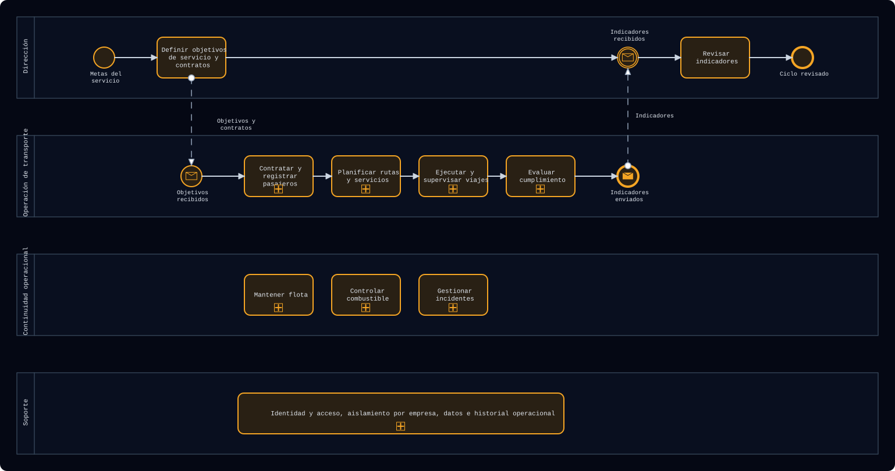
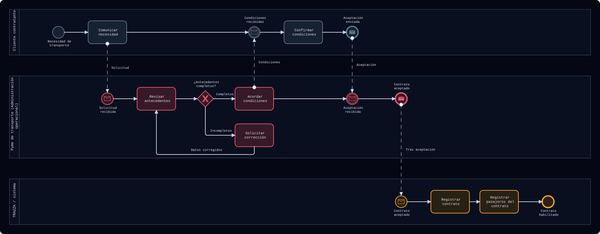
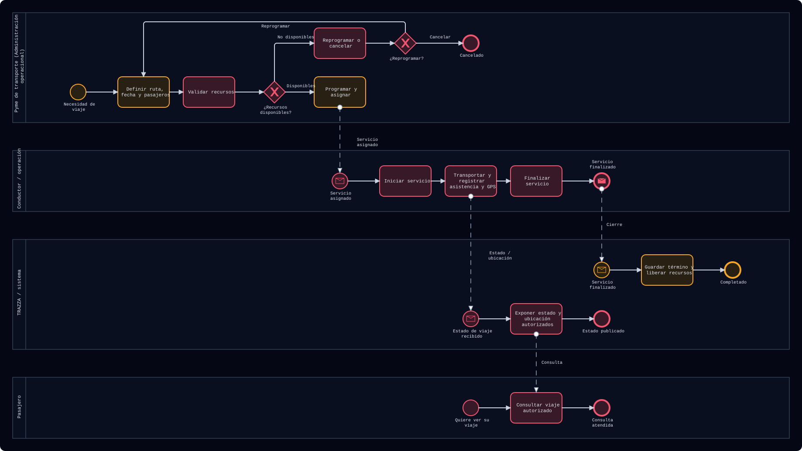
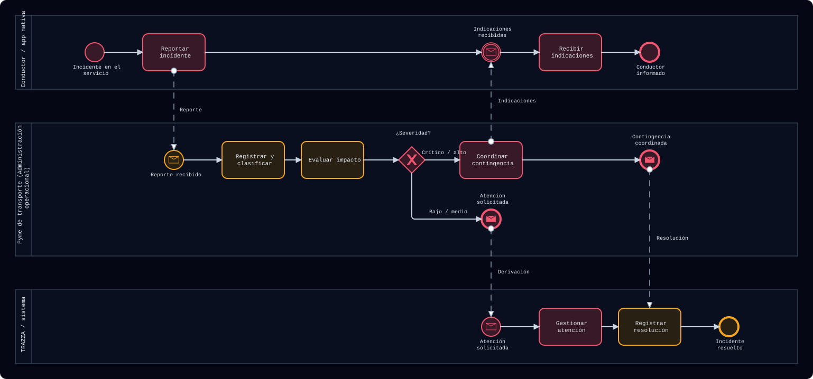
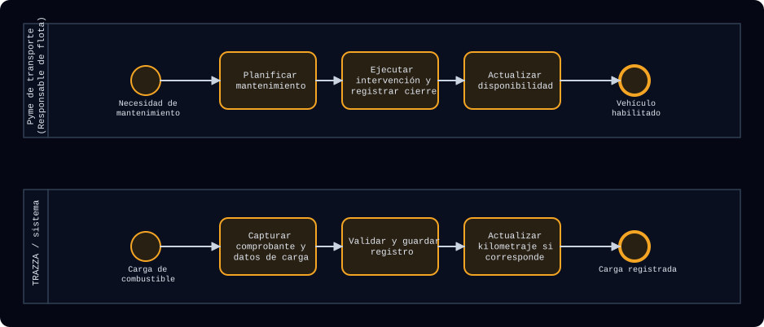

# TRAZZA

Plataforma de seguimiento en tiempo real para el transporte de personal.
Proyecto de título de Ingeniería en Informática (Capstone).

Este repositorio reúne el código del proyecto y su documentación. Más abajo están los diagramas de procesos, UML y arquitectura.
Haz clic en una imagen para verla en tamaño completo.

## Contenido del repositorio

| Carpeta | Qué contiene |
|---|---|
| `TrazzaAdmin` | Panel web administrativo |
| `TrazzaMobile` | App móvil del conductor |
| `docs` | Diagramas, plan de pruebas, planificación y presentaciones |
| `Franz Figueroa`, `Jose Villegas`, `Juan Marchant` | Carpetas personales de cada integrante |

## Cómo leer los diagramas

| Color | Significado |
|---|---|
| Ámbar | Actual: existe evidencia en el código o en la base de datos |
| Rosado | Proyectado: capacidad o regla futura |
| Gris | Externo: actividad del cliente o de un tercero |

Línea continua: secuencia dentro de un participante. Línea punteada: mensaje entre participantes.

---

# Procesos de negocio (BPMN)

## 1. Mapa de procesos del negocio

La pyme transforma una necesidad de transporte en un servicio trazable. El cliente contrata, el administrador planifica, el conductor ejecuta y el pasajero consulta. Cada cuadro con el signo + es un proceso que se detalla en los diagramas siguientes.

## 2. BPMN 01: Contratación y pasajeros

El cliente comunica la necesidad y confirma las condiciones. El administrador valida los antecedentes, registra el contrato y su nómina de pasajeros. La aprobación comercial ocurre fuera del panel actual.

## 3. BPMN 02: Planificar y ejecutar el servicio

Se prepara un recorrido y un viaje concreto. El inicio y el cierre actuales se hacen desde el panel. La app del conductor y el acceso del pasajero son proyectados, y la consulta del pasajero puede repetirse mientras el viaje está activo.

## 4. BPMN 03: Reportar y resolver incidentes

El conductor comunica un incidente y el administrador evalúa su impacto y las medidas. TRAZZA conserva la severidad, el estado y la resolución. Estados del incidente: abierto, en revisión y resuelto.

## 5. BPMN 04: Mantenimiento y combustible

Dos procedimientos independientes sostienen la flota. Mantenimiento: orden, intervención externa y cierre. Combustible: carga externa y registro operacional. La habilitación final requiere la revisión del responsable.

---

# UML

## 6. Actores y casos de uso

Muestra qué hace cada actor dentro del límite del sistema. El administrador gestiona contratos, rutas, incidentes y flota. El conductor ejecuta el viaje asignado y registra asistencia, GPS e incidentes. El pasajero consulta el estado y la ubicación de su propio viaje.

## 7. Ciclo de vida del servicio

Un servicio nace programado, pasa a en curso cuando se inicia y termina completado. También puede cancelarse. Los estados en la base de datos son `scheduled`, `in_progress`, `completed` y `cancelled`.

---

# Arquitectura

## 8. Contexto del sistema

TRAZZA centraliza la operación de transporte de la pyme. El administrador usa el panel web. El conductor y el pasajero son actores proyectados. Supabase aporta identidad y datos, Google Maps aporta mapas y lugares, y un servicio SMTP envía los correos de recuperación.

## 9. Contenedores y flujos

Muestra las piezas que componen el sistema y cómo se comunican: el navegador del administrador, el servidor Next.js, la app nativa del conductor, el acceso web del pasajero y los servicios de Supabase (Auth, Data API con RLS y Realtime).

## 10. Despliegue propuesto en la nube

Cómo se publicaría el sistema: el código vive en GitHub, se construye y publica en Vercel, y los datos quedan en Supabase administrado. Los usuarios entran desde el navegador o desde el teléfono.

## 11. Arquitectura lógica

Detalla la relación entre el panel web, el servidor Next.js, Supabase (Auth, Data API y Realtime), Google Maps y el servicio de correo. Lo marcado con [P] es proyectado.

---

## Archivos editables

Los diagramas BPMN también están en formato `.bpmn`, que se abre y se edita en [bpmn.io](https://demo.bpmn.io) o en Camunda Modeler.

- [Mapa de procesos](docs/Diagramas/github/bpmn/01-mapa-de-procesos.bpmn)
- [BPMN 01: Contratación y pasajeros](docs/Diagramas/github/bpmn/02-bpmn-contratacion.bpmn)
- [BPMN 02: Planificar y ejecutar el servicio](docs/Diagramas/github/bpmn/03-bpmn-planificar-ejecutar.bpmn)
- [BPMN 03: Reportar y resolver incidentes](docs/Diagramas/github/bpmn/04-bpmn-incidentes.bpmn)
- [BPMN 04: Mantenimiento y combustible](docs/Diagramas/github/bpmn/05-bpmn-flota-combustible.bpmn)

Los diagramas de UML y arquitectura también están como páginas interactivas en `docs/Diagramas/presentacion/figuras`.

## Equipo

José Villegas, Juan Marchant y Franz Figueroa.
